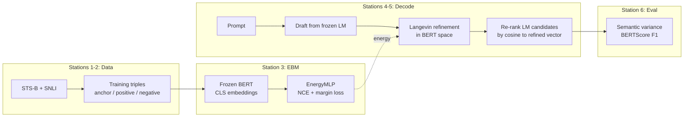
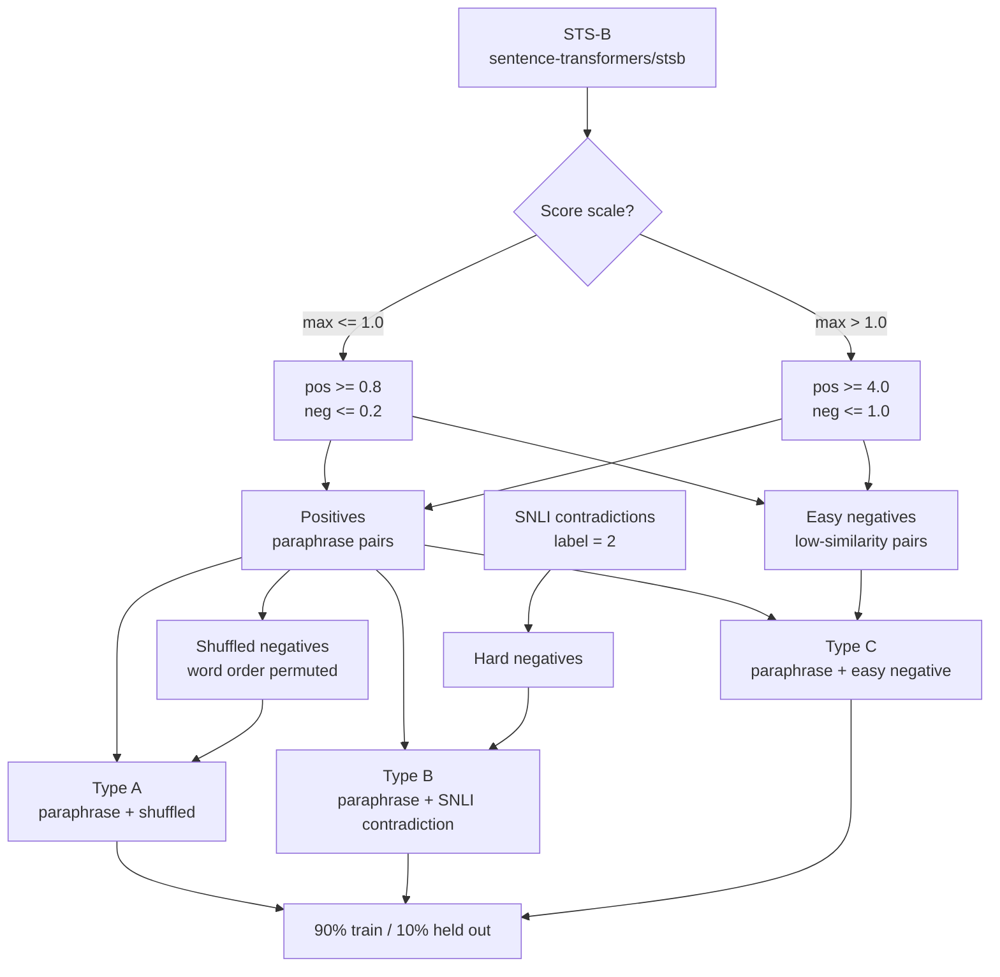
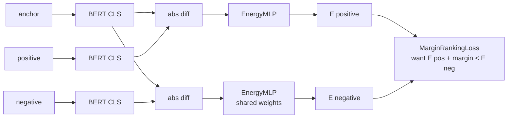
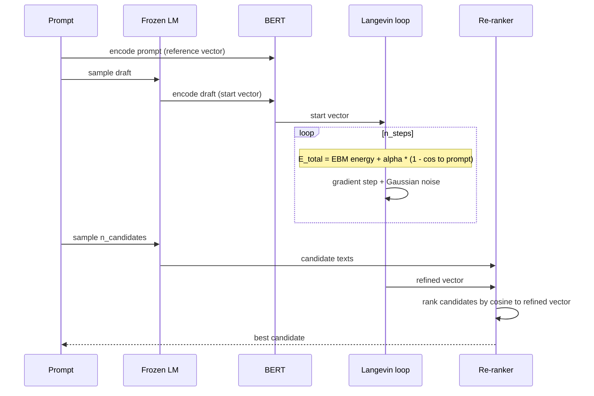
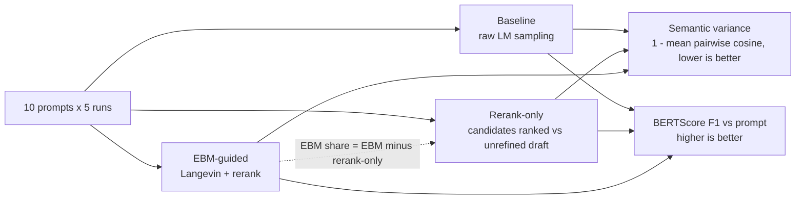
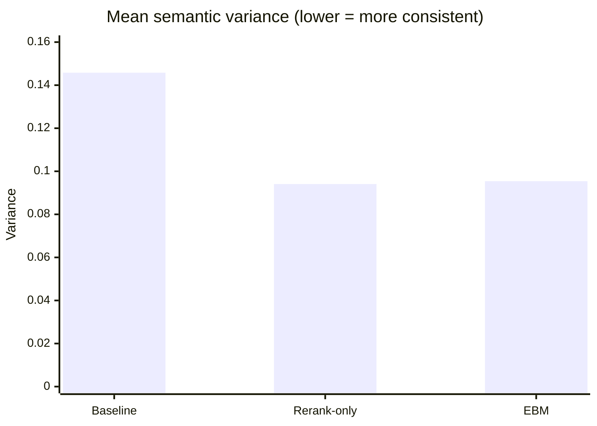
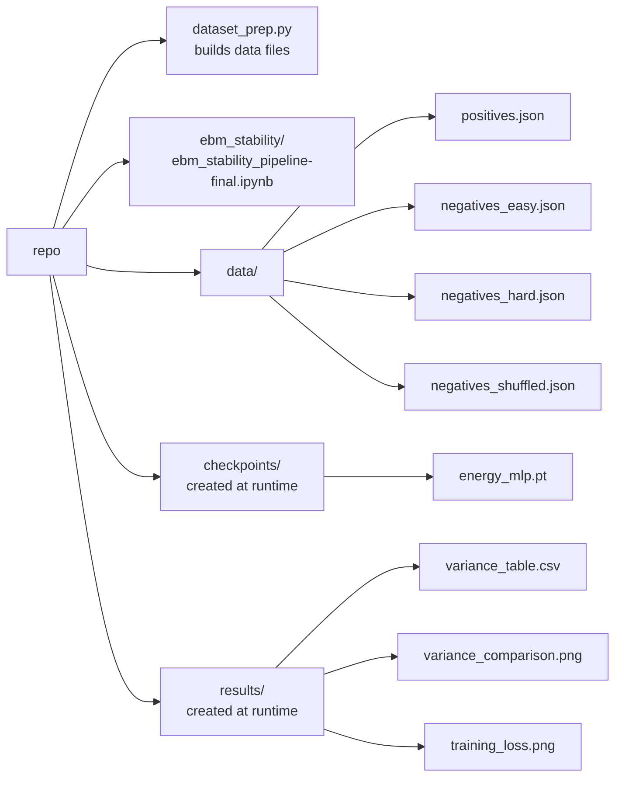

# Energy-Based Semantic Landscapes: Controlling Output Stability in Language Model Generation

Can a **learned energy function** make a small LLM give more consistent answers to the same question?
This project trains an energy-based model (EBM) on semantic-similarity data, refines a draft answer's BERT embedding with Langevin dynamics, and re-ranks the LM's candidate outputs by closeness to the refined vector. The LM stays frozen.

**Result in one line:** variance drops ~35%, but plain best-of-N re-ranking gets the same drop, so the EBM adds nothing measurable here (see [Results](#results)).

---

## Pipeline



### Stations 1-2: Data preparation

Each training example is a triple `(anchor, positive, negative)`. The positive is always a genuine paraphrase of the anchor, never the anchor itself (an identity positive makes `|anchor - positive| = 0` and the ranking task trivial).



### Station 3: Energy model

A two-layer MLP (`EnergyMLP`, 197,121 params) scores `|anchor - candidate|` (768-d, from frozen `bert-base-uncased` CLS embeddings). Trained with noise-contrastive estimation and `MarginRankingLoss` so that coherent pairs get **lower** energy than incoherent ones. The held-out split reports ranking accuracy alongside the loss curve.



### Stations 4-5: Langevin decoding with drift penalty



### Station 6: Evaluation

10 prompts x 5 runs under three arms. The rerank-only arm isolates the EBM's contribution from plain best-of-N re-ranking.



---

## Results

Latest notebook run: scale-aware STS-B threshold, non-identical positives, 10% held out. The language model was the **TinyLlama-1.1B-Chat fallback** (Phi-3-mini failed to load).

**Data:** 1,406 STS-B positives, 1,103 easy negatives, 3,000 SNLI contradictions -> 3,915 triples (3,523 train / 392 held out).

**EBM training:** loss 0.35 -> 0.13 over 5 epochs. Held-out ranking accuracy **365/392 = 93.1%**, mean energy margin (neg - pos) 2.25.

| System | Mean semantic variance | Reduction vs baseline | BERTScore F1 |
|---|---|---|---|
| Baseline (raw sampling) | 0.1458 | - | 0.8536 |
| Rerank-only (no EBM) | 0.0941 | 35.5% | 0.8532 |
| EBM (Langevin + rerank) | 0.0954 | 34.6% | 0.8534 |



**Takeaway:** the EBM pipeline cuts output variance by ~35% with no BERTScore loss, but plain best-of-N re-ranking gets the same reduction (EBM minus rerank-only = -0.9 pts; EBM wins on 5 of 10 prompts, loses on 5). The EBM scores well on its own ranking task, yet Langevin refinement adds no measurable stability beyond re-ranking. With 10 prompts x 5 runs and a single seed, differences this small are within noise.

---

## Comparison with COLD Decoding

Inspired by COLD Decoding (Qin et al., NeurIPS 2022). Both freeze the LM, apply Langevin dynamics in a continuous space, and inject noise during optimization.

| Aspect | COLD Decoding | This work |
|---|---|---|
| Energy function | Hand-crafted constraints | Learned MLP trained on STS-B + SNLI |
| Optimization space | Token logit space | BERT embedding space (768-d) |
| Decoding method | Soft tokens projected to vocabulary | Re-ranking from LM candidate pool |
| Drift control | LM log-probability | Cosine similarity to prompt embedding |
| Primary objective | Constraint satisfaction | Output variance reduction |
| Training required | No | Yes (NCE on semantic similarity data) |

---

## Repository structure



---

## Setup and usage

```bash
pip install transformers datasets torch scikit-learn bert-score tqdm numpy pandas matplotlib accelerate bitsandbytes
```

Open `ebm_stability/ebm_stability_pipeline-final.ipynb` and run cells in order. It handles data loading, EBM training, Langevin decoding, and evaluation end to end. To skip retraining, load `checkpoints/energy_mlp.pt` before the evaluation cells.

**Hardware:** a CUDA GPU is recommended. The LM is loaded in 4-bit (bitsandbytes) when available; CPU works but is much slower.

**Reproducibility:** global seed 42 for Python, NumPy, and PyTorch.

---

## Hyperparameters

| Parameter | Default | Description |
|---|---|---|
| `n_steps` | 10 | Langevin refinement iterations |
| `alpha` | 0.5 | Weight of drift penalty relative to EBM energy |
| `step_size` | 0.1 | Gradient step magnitude in Langevin update |
| `noise_scale` | 0.01 | Gaussian noise injected per step |
| `n_candidates` | 8 | LM samples for re-ranking |
| `temperature` | 0.9 | LM sampling temperature |
| `NUM_EPOCHS` | 5 | EBM training epochs |
| `margin` | 1.0 | MarginRankingLoss margin |
| `learning_rate` | 2e-4 | Adam learning rate |
| `batch_size` | 32 | Training batch size |

## Models and datasets

- **BERT:** `bert-base-uncased` (frozen encoder)
- **LM:** `microsoft/Phi-3-mini-4k-instruct`, fallback `TinyLlama/TinyLlama-1.1B-Chat-v1.0` (used in the latest run)
- **Data:** `sentence-transformers/stsb`, `stanfordnlp/snli`
